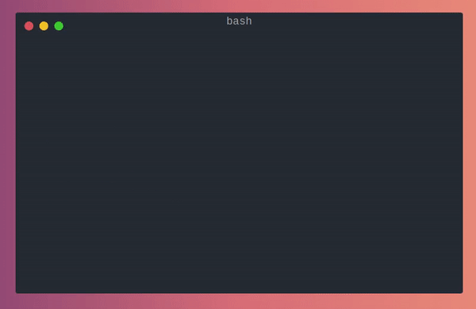
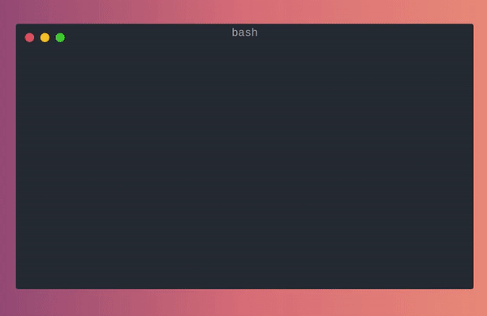
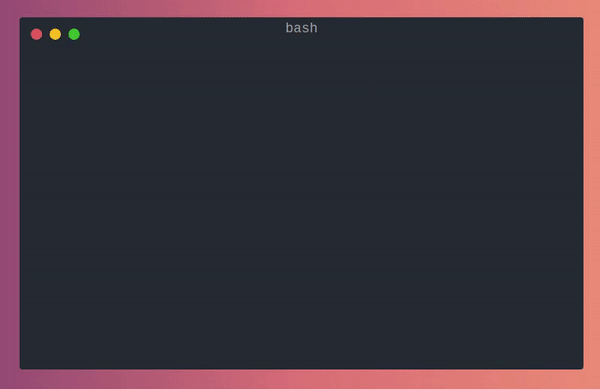

# Kurby
[](https://docs.python.org/3/whatsnew/3.7.html) [](https://pepy.tech/badge/kurby) [](https://badge.fury.io/py/kurby.svg)

<div align="center">
    
</div>
<br>


Kurby is a nice and simple CLI that use [Twist](https://twist.moe) website, and their huge collection to download animes for free and **automatically**

Animes from Twist are generally in High Definition with English subtitles. Please consider [donating](https://twist.moe) for their amazing work :)

## Overview
The CLI is built with [Typer](https://github.com/tiangolo/typer) and it is composed of 3 commands

- `animes`: Search animes to find what is available and extract the slug to be used in the other commands


  
> `--search` option allows you to make a fuzzy search
  
- `details`: Show details of an anime if needed


  
> You can see the number of episodes available and when the first and last episode were uploaded
  
- `download`: Choose and download which episodes of the anime you want !



> Because sometimes bad things can happen, Kurby will automatically retry for you

You can also download without having a slug initially. In this case, Kurby will propose you a selection



#### And that's it !

You can also use `kurby --help` to get more information on the different commands

## Installation
```bash
pip install kurby
kurby --help
```

## Installation on Windows
- Right click on the `install.bat` and run it as an **Administrator**, this will install [Chocolatey](https://chocolatey.org/) who will manage the python installation
- Once the installation is finished, and you're asked to press a key, open a new terminal (`Win + R` > `cmd` )
- You can now start using Kurby with `kurby --help`

## Installation on Android without root needed
- Install [Termux](https://play.google.com/store/apps/details?id=com.termux) on your Android phone
- In Termux, run this command to allow access to storage: `termux-setup-storage`, and tap allow
- Next, run the follow command `pkg install git python`
- Then `pip3 install kurby`
- You're done ! You can download animes on your phone like so `kurby download --d ~/storage/shared`

##### *Thanks to [6b86b3ac03c167320d93](https://www.reddit.com/user/6b86b3ac03c167320d93/) for this tutorial*

## Installation from sources
### Create your virtual environment (optional)
````bash
mkvirtualenv kurby
workon kurby
````
### Install poetry
```bash
curl -sSL https://raw.githubusercontent.com/python-poetry/poetry/master/get-poetry.py | python -
```
### Install dependencies using poetry
```bash
poetry install --no-dev
kurby-cli --help # or python kurby-cli --help
```

## Getting the latest episode automatically
An interesting use case is to get the latest episode of an anime as soon as it is available.

This is possible on Linux using `crontab` (or another equivalent on others OS) and _a little tweak of chemistry_.
Here is an example of a few instructions that can help you do this.
```shell
now=$(date -u "+%Y-%m-%dT%H:%M:%S")
date=$(cat kurby.date || echo $now) # Get the date of previous download
python kurby download {{YOUR_ANIME}} --dfrom=${DATE} # Download any episodes that has been uploaded since the last time
echo $now > kurby.date # Store the current date as the new date
```

## Next steps
Kurby is already functional as it is but here are the next things I would like to add :
- Adding the support of asynchronous download
- Refactor the retrying strategy to add more customisable options and allow errors during a download without interruption
- Refactor the crawling process to potentially avoid being detected as a bot

### Disclaimer
Downloading copyright videos may be illegal in your country.

This tool is for educational purposes only.

The developers or this application do not store or distribute any files whatsoever.
