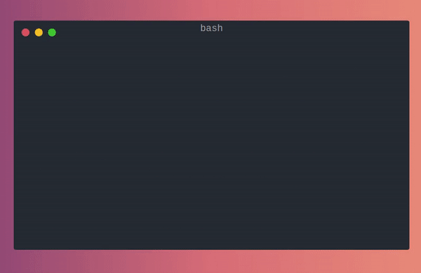

# Kurby
[](https://docs.python.org/3/whatsnew/3.7.html)


<div align="center">
    
</div>
<br>


Kurby is a nice and simple CLI that use [Twist](https://twist.moe) website and their huge collection to download animes for free and **automatically**

Animes from Twist are generally in High Definition with English subtitles

## Overview
The CLI is built with [Typer](https://github.com/tiangolo/typer) and it is composed of 3 commands

- `animes`: Search animes to find what is available and extract the slug to be used in the other commands


  
> `--search` option allows you to make a fuzzy search
  
- `details`: Show details of an anime if needed


  
> You can see the number of episodes available and when the first and last episode were uploaded
  
- `download`: Choose and download which episodes of the anime you want !



> Because sometimes bad things can happen, Kurby will automatically retry for you

#### And that's it !

You can also use `python kurby.py --help` to get more information on the different commands

## Installation
### Create your virtual environment
````bash
mkvirtualenv kurby -p=python3.9
workon kurby
````
### Install poetry
```bash
curl -sSL https://raw.githubusercontent.com/python-poetry/poetry/master/get-poetry.py | python -
```
### Install dependencies using poetry
```bash
poetry install
```

## Getting the latest episode automatically
An interesting use case is to get the latest episode of an anime as soon as it is available.

This is possible on Linux using `crontab` (or another equivalent on others OS) and _a little tweak of chemistry_.
Here is an example of a few instructions that can help you do this.
```shell
now=$(date -u "+%Y-%m-%dT%H:%M:%S")
date=$(cat kurby.date || echo $now) # Get the date of previous download
python kurby.py download {{YOUR_ANIME}} --dfrom=${DATE} # Download any episodes that has been uploaded since the last time
echo $now > kurby.date # Store the current date as the new date
```

## Next steps
Kurby is already functional as it is but here are the next things I would like to add :
- Adding the support of asynchronous download
- Refactor the retrying strategy to add more customisable options and allow errors during a download without interruption
- Refactor the crawling process to potentially avoid being detected as a bot
- Rewrite the CryptoJS library to replace the 40k of code generated by `js2py` and make the start of the CLI faster